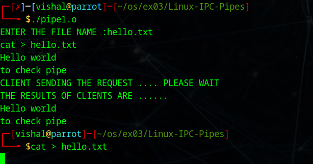
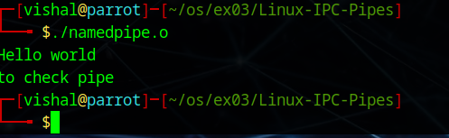

# Linux-IPC--Pipes
Linux-IPC-Pipes


# Ex03-Linux IPC - Pipes

# AIM:
To write a C program that illustrate communication between two process using unnamed and named pipes

# DESIGN STEPS:

### Step 1:

Navigate to any Linux environment installed on the system or installed inside a virtual environment like virtual box/vmware or online linux JSLinux (https://bellard.org/jslinux/vm.html?url=alpine-x86.cfg&mem=192) or docker.

### Step 2:

Write the C Program using Linux Process API - pipe(), fifo()

### Step 3:

Testing the C Program for the desired output. 

# PROGRAM:

## C Program that illustrate communication between two process using unnamed pipes using Linux API system calls

```c
#include<stdio.h>
#include<stdlib.h>
#include<sys/types.h> 
#include<sys/stat.h> 
#include<string.h> 
#include<fcntl.h> 
#include<unistd.h>
#include<sys/wait.h>
void server(int,int); 
void client(int,int); 
int main() 
{ 
int p1[2],p2[2],pid, *waits; 
pipe(p1); 
pipe(p2); 
pid=fork(); 
if(pid==0) { 
close(p1[1]); 
close(p2[0]); 
server(p1[0],p2[1]); return 0;
 } 
close(p1[0]); 
close(p2[1]); 
client(p1[1],p2[0]); 
wait(waits); 
return 0; 
} 

void server(int rfd,int wfd) 
{ 
int i,j,n; 
char fname[2000]; 
char buff[2000];
n=read(rfd,fname,2000);
fname[n]='\0';
int fd=open(fname,O_RDONLY);
sleep(10); 
if(fd<0) 
write(wfd,"can't open",9); 
else 
n=read(fd,buff,2000); 
write(wfd,buff,n); 
}
void client(int wfd,int rfd) {
int i,j,n; char fname[2000];
char buff[2000];
printf("ENTER THE FILE NAME :");
scanf("%s",fname);
printf("CLIENT SENDING THE REQUEST .... PLEASE WAIT\n");
sleep(10);
write(wfd,fname,2000);
n=read(rfd,buff,2000);
buff[n]='\0';
printf("THE RESULTS OF CLIENTS ARE ...... \n"); write(1,buff,n);
}
```


## OUTPUT




## C Program that illustrate communication between two process using named pipes using Linux API system calls

```c
#include <stdio.h>
#include <stdlib.h>
#include <unistd.h>
#include <fcntl.h>
#include <sys/types.h>
#include <sys/stat.h>
#include <string.h>

#define FIFO_FILE "/tmp/my_fifo"
#define FILE_NAME "hello.txt"

void server();
void client();

int main() {
    pid_t pid;

    mkfifo(FIFO_FILE, 0666);

    pid = fork();

    if (pid > 0) {
        sleep(1);
        server();
    } else if (pid == 0) {
        client();
    } else {
        perror("Fork failed");
        exit(EXIT_FAILURE);
    }

    return 0;
}

void server() {
    int fifo_fd, file_fd;
    char buffer[1024];
    ssize_t bytes_read;

    file_fd = open(FILE_NAME, O_RDONLY);
    if (file_fd == -1) {
        perror("Error opening hello.txt");
        exit(EXIT_FAILURE);
    }

    fifo_fd = open(FIFO_FILE, O_WRONLY);
    if (fifo_fd == -1) {
        perror("Error opening FIFO");
        exit(EXIT_FAILURE);
    }

    while ((bytes_read = read(file_fd, buffer, sizeof(buffer))) > 0) {
        write(fifo_fd, buffer, bytes_read);
    }

    close(file_fd);
    close(fifo_fd);
}

void client() {
    int fifo_fd;
    char buffer[1024];
    ssize_t bytes_read;

    fifo_fd = open(FIFO_FILE, O_RDONLY);
    if (fifo_fd == -1) {
        perror("Error opening FIFO");
        exit(EXIT_FAILURE);
    }

    while ((bytes_read = read(fifo_fd, buffer, sizeof(buffer))) > 0) {
        write(STDOUT_FILENO, buffer, bytes_read);
    }

    close(fifo_fd);
}


```


## OUTPUT




# RESULT:
The program is executed successfully.
